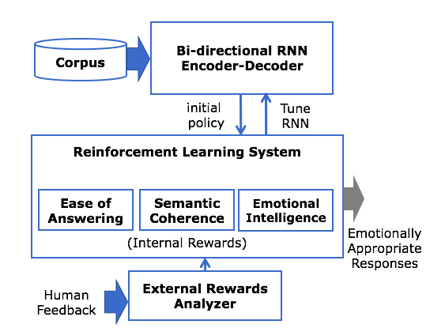

# ICMLA

This repository contains the source code of both cornell and yelp models that use both internal/external rewards for emotional natural language generation.

Please contact vsriniv6@uncc.edu if you have any further questions with regards to this project. 
