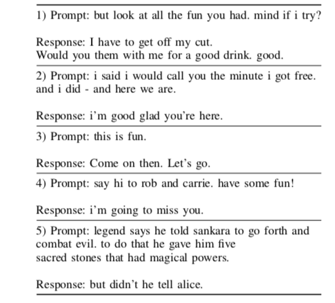

# Emotional Natural Language Generation
This repository contains scripts for the implementation of model as suggested in the paper titled [Natural Language Generation Using Reinforcement Learning with External Rewards](https://arxiv.org/abs/1911.11404)
<b><i>Deep Neural Language Generation with Emotional Intelligence and External Feedback</i></b> 
<b>Keywords:</b><i> deep learning, reinforcement learning, emotional intelligence, human feedback, seq2seq learning, conversational agent, affectively diverse beam search.</i> 

Neural seq2seq models are widely used to generate dialogue using variations of RNN Encoder-Decoder architecture with maximum likelihood estimation as objective function. Advances in this architecture include introducing reinforcement learning to tune network parameters (Li et al., 2016, Christiano et al., 2017). In this research, we focus on generating affective responses in an attempt to create conversational agent that cater to emotional context of conversation.  
   We propose a novel approach using bidirectional RNN Encoder-Decoder seq2seq model with attention mechanism and maximum mutual information as initial objective function combined with Reinforcement Learning (RL). We train our own word2vec embeddings with appended valence, arousal and dominance (Warriner et al., 2013) scores as input. We use an AlphaGo-style strategy by initializing RL system with general response policy learnt from our seq2seq model, which is then tuned using policy gradient method. The internal rewards are Ease of Answering, Information Flow, Semantic Coherence (Li et al., 2016) and Emotional Intelligence, incorporated by maximizing affective content (Asghar et al., 2017) using the valence, arousal and dominance scores for each word in the response. We use a two-part training scheme, where we train a separate external reward analyzer to predict the reward using human feedback and then use RL system on predicted rewards to maximize the expected rewards (both internal and external). This synthetic feedback (Christiano et al., 2017) from the external reward analyzer is provided throughout the training phase and top-n affective responses are re-ranked based on this feedback using affectively diverse beam search (Asghar et al., 2017). The novelty of our approach lies in the addition of Emotional Intelligence as a reward function and combining both internal and external rewards to create an emotionally appropriate model that closely imitates human. We use the standard evaluation metrics like BLEU, Perplexity, Word Error Rate, ROUGE along with the human evaluation to evaluate our models. 
   

<b>References:</b>
   <ol>
      <li>Li, Jiwei et al. “Deep Reinforcement Learning for Dialogue Generation.” EMNLP (2016).</li>
<li>Christiano, Paul F., et al. "Deep reinforcement learning from human preferences." Advances in Neural Information Processing Systems. 2017.</li>
 <li>Asghar, Nabiha et al. “Affective Neural Response Generation.” ECIR (2018).</li>
<li>Warriner, Amy Beth, Victor Kuperman, and Marc Brysbaert. "Norms of valence, arousal, and dominance for 13,915 English lemmas." Behavior research methods 45.4 (2013): 1191-1207.</li></ol>
<b> Examples from Cornell Corpus</b> 
 
<b> Examples from Yelp Corpus</b> 

# Overview of MTurk Experiments

Please contact vidhushinisrinivasan@gmail.com if you have any further questions with regards to this project. 
